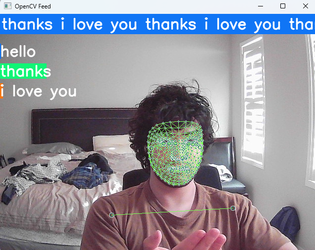
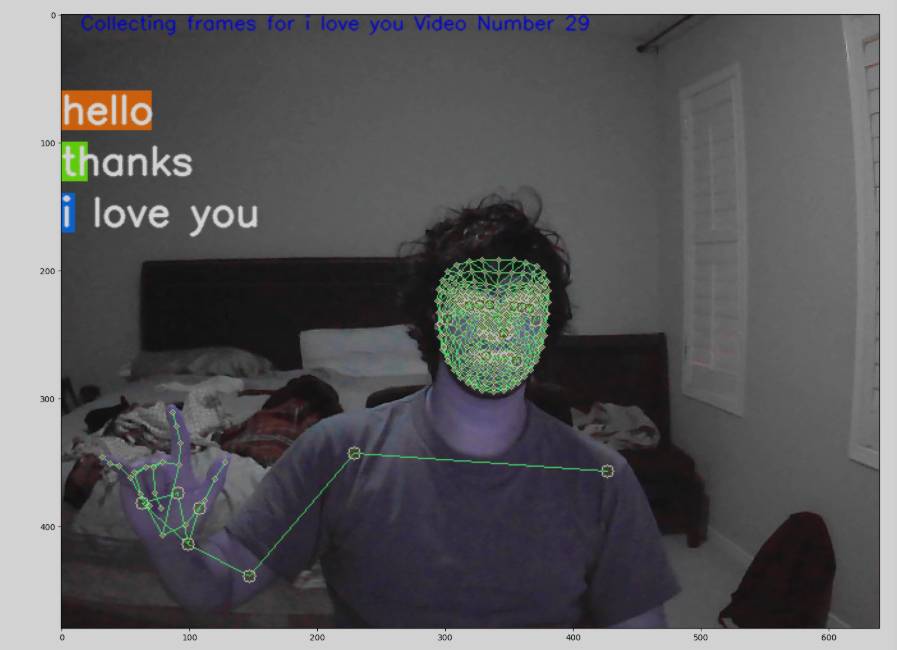

# Signlangdetec

**Translating standard American sign language into captions in real time**

---

## Table of Contents

- [Project Overview](#project-overview)
- [Features](#features)
- [Demo](#demo)
- [Installation](#installation)
- [Usage](#usage)
- [Project Structure](#project-structure)
- [Contributing](#contributing)
- [License](#license)
- [Acknowledgements](#acknowledgements)

---

## Project Overview

Signlangdetec is an open-source project that leverages computer vision and machine learning to translate standard American Sign Language (ASL) gestures into real-time captions. Built primarily in Jupyter Notebook, this project aims to bridge the communication gap for the deaf and hard-of-hearing community by providing instant captioning for sign language.

---

## Features

- **Real-Time ASL Detection**: Processes video input and identifies ASL gestures on the fly.
- **Caption Generation**: Converts recognized gestures into English captions in real time.
- **Jupyter Notebook Implementation**: Easy to understand, experiment with, and extend.
- **Open-Source Models**: Utilizes and/or fine-tunes pre-trained models for hand gesture and sign detection.
- **Customizable Pipeline**: Modular code for dataset preprocessing, model training, and inference.

---

## Demo




---

## Installation

### Prerequisites

- Python 3.7+
- Tensorflow 2.10+
- For those wanting to change the model, a dedicated GPU is recommended
- [pip](https://pip.pypa.io/en/stable/)

### Required Packages

Install dependencies via pip:

```bash
pip install -r requirements.txt
```
> If `requirements.txt` is not present, install common dependencies manually:
```bash
pip install numpy opencv-python mediapipe tensorflow matplotlib
```

---

## Usage

1. **Clone the Repository**
    ```bash
    git clone https://github.com/ShubsMO6/Signlangdetec.git
    cd Signlangdetec
    ```

2. **Start the App**
    ```bash
    python app.py
    ```
    Will add an installer to package it as a full standalone app - incoming!

---

## Project Structure

```
Signlangdetec/
│
├── notebooks/                # Jupyter Notebooks for model training and inference
├── data/                     # Datasets and data processing scripts
├── models/                   # Saved or pre-trained models
├── utils/                    # Utility scripts (hand detection, preprocessing, etc.)
├── requirements.txt          # Python dependencies
├── README.md                 # Project documentation
└── ...                       # Other files
```

---

## Contributing

We welcome contributions!

1. Fork the repository
2. Create a new branch: `git checkout -b feature/your-feature-name`
3. Commit your changes: `git commit -am 'Add new feature'`
4. Push to the branch: `git push origin feature/your-feature-name`
5. Open a Pull Request


---

## Acknowledgements

- [MediaPipe](https://mediapipe.dev/) for hand tracking and gesture recognition.
- [TensorFlow](https://www.tensorflow.org/) for model training and inference.
- The open-source ASL dataset contributors.
- Inspiration from the broader machine learning and accessibility communities.

---

*For questions or suggestions, feel free to open an issue or contact the maintainer.*
